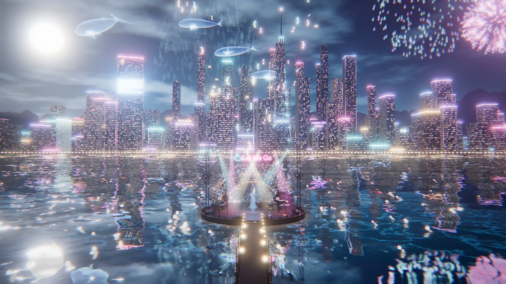

# 大肥鱼 · Let Me Go —— MMD 背景大场景（three.js）

给蓝色大肥鱼（DeepSeek 娘）的《Let Me Go》MMD 做的背景：**午夜海湾上的爵士舞台**，背后是会随歌词亮灯、崩溃、重启的霓虹城市，天上游着星斑鲸鱼。
只负责场景和场景状态：所有灯光/特效都由「歌曲时间」决定，接到你的 MMD 播放器里传 `audio.currentTime` 就能对上。


| 正面（副歌） | "when the system falls"（服务器繁忙） |
|---|---|
|  |  |
| **侧面（主歌）** | **终副歌（烟花）** |
|  |  |

## 预览

```bash
npm install
cp 你的/Let_Me_Go.mp3 public/audio/let-me-go.mp3   # 歌曲不进仓库；没有也能跑，页面上可以手动选 mp3
npm run dev
```

- 空格播放/暂停，←/→ 快进快退 5 秒，1–7 切机位，H 隐藏界面
- 右上角机位：正面 / 近景 / 全景 / 城市 / 侧面 / 背面 / 俯瞰；「漫游」绕舞台慢转
- 「身高参考」是一个 20 单位高的半透明人形，代表 MMD 角色的大小和站位，只在预览页里有
- URL 参数：`?t=51.4` 从某秒开始，`?view=wide` 初始机位，`?q=low|high|ultra` 画质，`?ui=0` 隐藏界面，`?bloom=0` 关泛光

## 接到你的 MMD 播放器

```js
import * as THREE from 'three'
import { createWorld, createPostFX } from './src/index.js'

renderer.toneMapping = THREE.ACESFilmicToneMapping
renderer.shadowMap.enabled = true
camera.near = 1
camera.far = 80000 // 城市在 6000+，远山在 30000+

const world = createWorld(renderer, { quality: 'high' }).attach(scene) // 会设置 scene.fog / environment / background
world.setSize(innerWidth, innerHeight, renderer.getPixelRatio())
const post = createPostFX(renderer, scene, camera) // 可选：泛光 + 调色 + 故障效果
post.setSize(innerWidth, innerHeight)

mmdMesh.position.copy(world.anchor) // 原点，台面 y = 0，面朝 +Z
mmdMesh.traverse((o) => { if (o.isMesh) o.castShadow = true }) // 舞台主光会投影

function frame() {
  const t = audio.currentTime // 与 MMD 动作用同一个时间
  world.update(t, camera) // 返回并保存在 world.state 里
  post.render(world.state) // 不用后期就 renderer.render(scene, camera)
  requestAnimationFrame(frame)
}
```

要点：

- **单位**就是 MMD 单位（1 ≈ 8cm）。舞台是中心在 `z = -12`、半径 52 的圆台，角色活动区大约是原点周围半径 16，道具都在这圈外面；台前栈桥伸向 +Z。
- `world.update(t)` 是纯函数式的：任意跳时间、倒放、逐帧离线渲染都会得到同一画面，不依赖上一帧。
- 如果你的 VMD 相对 mp3 有偏移，给 `world.update` 传的也应该是**音频时间**。
- 海面是实时镜面反射，角色会出现在倒影里；想省性能可以 `?q=low` 或把 `world.parts.ocean.object.visible = false`。
- MMD 的卡通材质在 ACES 色调映射下如果偏灰，可以给角色材质设 `toneMapped = false`。
- `world.parts` 里能拿到各部分（`sky / ocean / city / landscape / whales / stage / particles / screens`），想关掉某块直接 `visible = false`。

## 场景构成（近处细、远处粗）

| 距离 | 内容 |
|---|---|
| 近景（0–150） | 圆形木台（逐块木板、黄铜包边、深蓝漆裙边、中心鲸鱼徽章）、五道同心拱门灯泡墙、"Let Me Go" 霓虹招牌、灯架 + 6 台摇头灯（真实聚光 + 体积光柱）、低音提琴、三角钢琴（撑开琴盖、铁板琴弦、乐谱）、复古麦克风、红酒小圆桌（酒瓶标签、会倒满的酒杯、**一碗白饭**和筷子）、曲木椅、CRT 终端（屏幕内容跟歌词走）+ 鲸鱼玩偶、白色五瓣花箱、灯架上的深蓝蝴蝶结、JSON 全息光环、木栈桥 |
| 中景（150–10000） | 实时反射海面（荧光海、月光路径）、水面河灯、灯塔礁（旋转光柱）、跨海大桥（主缆灯链、车流）、霓虹城市约 1200 栋楼（窗户/霓虹全在 shader 里）、深海尖塔、巨幅广告屏、楼顶招牌、天空鲸 |
| 远景（10000+） | 远处楼群、两层山脊剪影、夜空（银河、星星、月亮、薄云、流星） |

## 歌词 → 场景状态

歌词由 faster-whisper large-v3 转写 mp3 得到，修正了明显误听（`call the two → call the tool`、`A.B.I. → API`、`Jason → JSON`），时间精度约 ±0.2s，**可能仍有听错的词**，以原曲为准。BPM ≈ 128.2（频谱通量自相关估计）。

| 时间 | 歌词 | 场景 |
|---|---|---|
| 0:00 | Let me go / I'm making the calls / Let me write the JSON / I'll call the tool | 城市漆黑，拱门灯泡一颗颗亮起；终端逐字打出 tool call；每唱到 calls / JSON / tool 就从招牌顶发一束数据光打到城市某栋楼 |
| 0:22 | The city hums in a minor key | 城市从左到右扫亮 |
| 0:25 | My screen is glowing like a midnight sea | 海面荧光亮起，JSON 全息光环出现 |
| 0:29 | I check the payload, one, two, three | 三束数据光依次发射 |
| 0:32 | Got a little API waiting on me | 屏幕显示 "API waiting on me…" |
| 0:36 | The bass goes walking, the cursor slides | 低音提琴发光、灯泡跟着拍子"走路"；广告屏上巨大光标滑过 |
| 0:40 | I'm chasing endpoints through neon lights | 连发数据光，全城霓虹逐个点亮 |
| 0:44 | If the answer's late, I'll pour some wine | 小桌台灯亮起，酒杯倒满 |
| 0:47 | And let the air swing in four-four time | 摇头灯开始按 4/4 摇摆（1、3 拍到两端） |
| 0:51 | 副歌 1 | 霓虹全开、天空鲸出现、灯泡追逐、每两小节补一发数据光 |
| 1:16 | A little bit of swing when the system falls | 城市从右往左断电，屏幕"服务器繁忙，请稍后再试。"，画面故障 |
| 1:20 | I'll call the tool | 一瞬间全部恢复 |
| 1:26 | 间奏 | 灯泡继续追逐、天空鲸巡游 |
| 1:33 | The request is due / Scooby-doo… / The JSON's free | JSON 符号从舞台飘向天空 |
| 1:40 | So let me go | 屏息：灯光压暗，只剩招牌在呼吸 |
| 1:43 | 终副歌 | 巨鲸跃出海湾、烟花、最高亮度 |
| 1:59 | And swing it on | 全场一闪，收尾 |

改时间点看 `src/lyrics.js`，改每个量怎么随时间变化看 `src/state.js`（`TRACKS` 里是 `[时间, 值]` 关键帧）。

## 目录

```
src/
  index.js        对外入口
  lyrics.js       歌词时间轴、段落、工具调用时间点
  state.js        computeState(t)：歌曲时间 → 场景状态（纯函数）
  postfx.js       后期（高光钳制、泛光、调色、故障）
  main.js         预览页
  world/
    index.js      场景总装
    stage.js      近景舞台与道具
    city.js       霓虹城市（InstancedMesh + 窗户 shader）
    landscape.js  远山、岬角岛、跨海大桥、灯塔
    ocean.js      反射海面
    sky.js        夜空
    whales.js     程序化鲸鱼（天空鲸、跃海鲸）
    particles.js  河灯、泡泡、光尘、JSON 符号、数据光、烟花
    screens.js    终端 / 广告屏画布内容
    textures.js   程序化贴图（木纹、徽章、招牌、乐谱、酒标、碗）
```

全部几何和贴图都是代码生成的，没有外部模型或图片。

## 素材说明

- 歌曲：《Let Me Go》，[B 站 BV1mThC6LEbA](https://www.bilibili.com/video/BV1mThC6LEbA)（小猪P_），原曲 BV1XbY66nEWr（罐装毕加索）、BV13SYr6dEiQ（星落落_oi）。音频不包含在仓库里。
- 角色人设参考：蓝色大肥鱼 / DeepSeek 娘社区二创形象（蓝色渐变长发、鲸类头鳍、鲸尾、深蓝白女仆装、主食白饭）。
