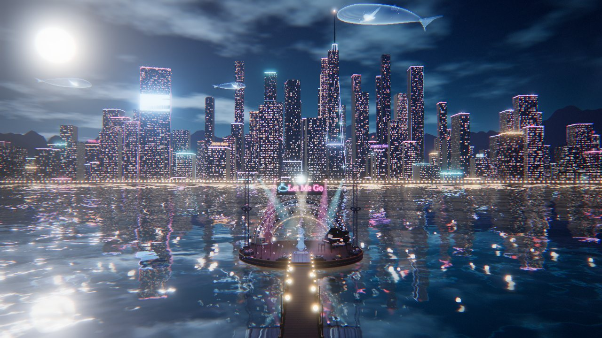
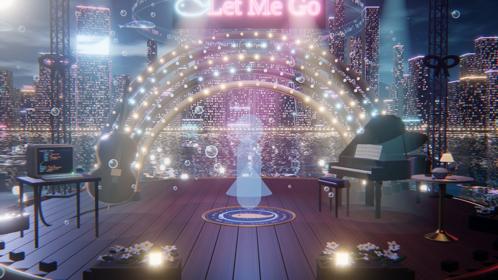
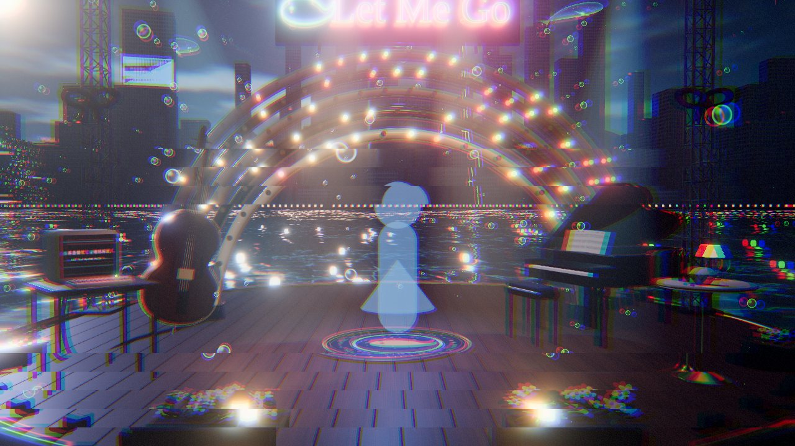
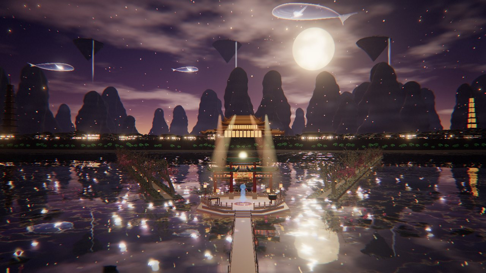
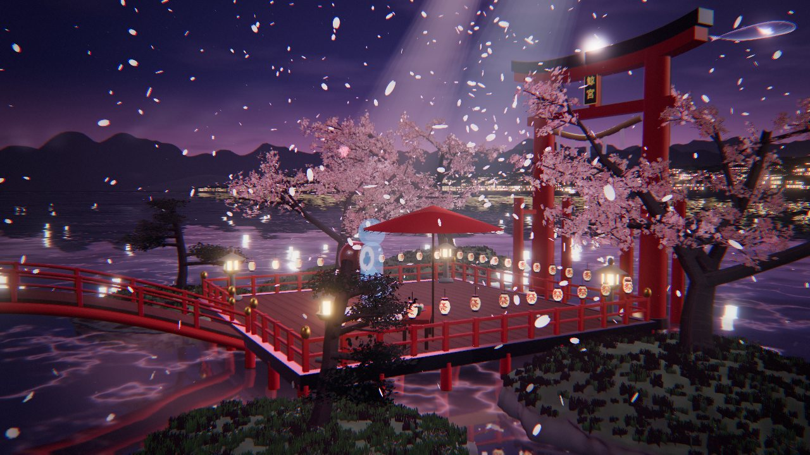
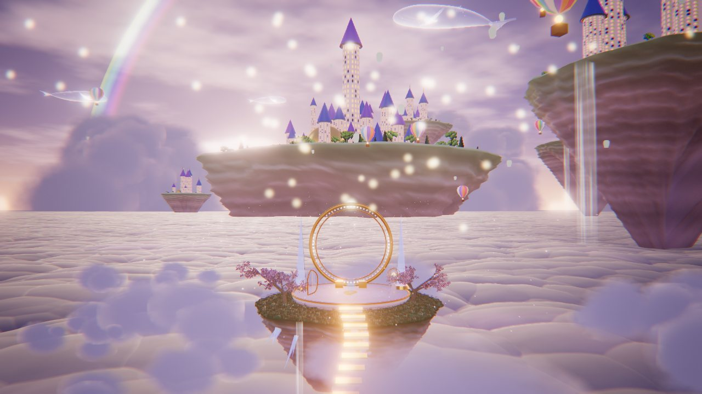
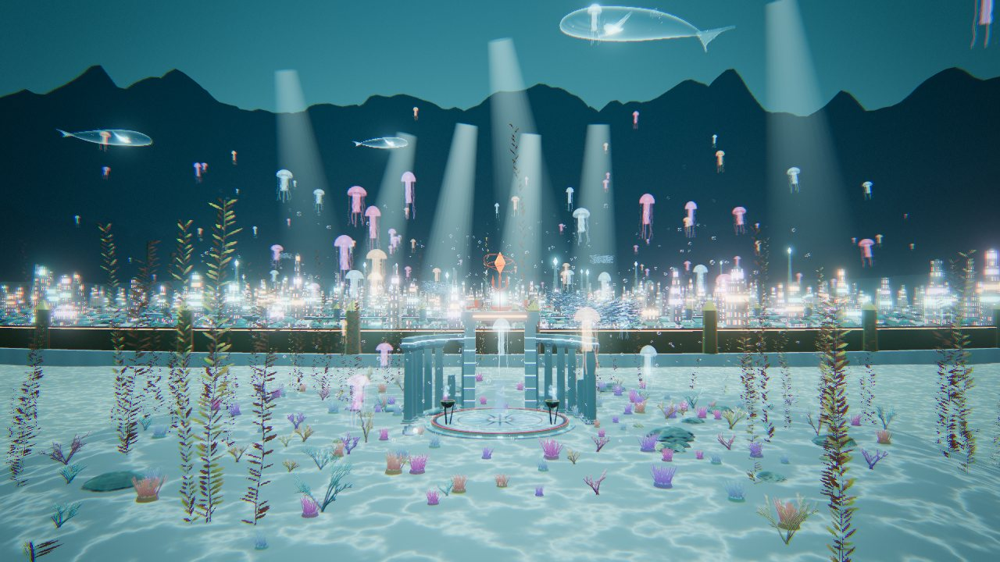

# 大肥鱼 · Let Me Go —— MMD 背景大场景（three.js）

给蓝色大肥鱼（DeepSeek 娘）的《Let Me Go》MMD 做的背景。一共 **5 套大场景**，可以按歌曲段落无缝溶解切换：

| 场景 | 一句话 |
|---|---|
| `harbor` 午夜海湾 | 海湾上的爵士舞台，背后会随歌词亮灯、崩溃、重启的霓虹城市 |
| `ancient` 古风城群 | 中秋月夜的临湖都城：汉白玉露台、"逍遥游"牌坊、柳堤桃花、万家灯火、喀斯特群峰、浮空仙山 |
| `japan` 和风群 | 樱花湖畔的神社舞台：大鸟居、太鼓桥、樱树与黑松、町屋灯海、天守阁、千本鸟居、富士山 |
| `clouds` 梦幻云层 | 夕照云海之上的浮空圆台：金色光环、积云海、浮空岛城堡、热气球、彩虹 |
| `atlantis` 亚特兰蒂斯 | 海底的同心环之城：马赛克圆台、残柱廊、三叉戟门、珊瑚海葵巨藻、金属城墙、波塞冬神庙与山铜核心、鱼群水母 |

只负责场景和场景状态：所有灯光/特效都由「歌曲时间」决定，接到你的 MMD 播放器里传 `audio.currentTime` 就能对上。
面数没有为实时压缩（目标是离线逐帧渲染），高画质下单个主题几十万到几百万三角形。



| 午夜海湾 · 正面（副歌） | "when the system falls"（服务器繁忙） |
|---|---|
|  |  |
| **古风城群** | **和风群** |
|  |  |
| **梦幻云层** | **亚特兰蒂斯** |
|  |  |

## 预览

```bash
npm install
npm run dev   # 仓库自带 public/audio/let-me-go.mp3；也可以替换或在页面上手动选 mp3
```

- P 播放/暂停，←/→ 快进快退 5 秒，1–7 切机位，H 隐藏界面；手动运镜下 WASD 前后左右、空格上升、Shift 下降
- 右上角机位：正面 / 近景 / 全景 / 城市 / 侧面 / 背面 / 俯瞰；「漫游」绕舞台慢转
- 底栏三个下拉框：模型、运镜默认「blend 版」，管线默认「web 版」（只换角色/运镜/后期，场景不动）：
  - **模型**：blend 版 = v2c 的角色、舞蹈、口型/笑容/眨眼、卡通材质与描边；也可切「身高参考」（20 单位高的半透明人形）或隐藏。数据见 `public/models/README.md`
  - **运镜**：blend 版 = v2c 的 DS_Cam / DS_CamOrtho（含 104 秒后跟脸的 v3 运镜，`public/data/camera-blend-v3.json`）；「手动」才用右上角机位和漫游
  - **管线**：web 版（默认）= 仓库原来的后期链；blend 版 = v2c 的 `post_final.py`（角色单独一层盖在 ACES 之后的场景上）；
    blend 版·无阴影 = 同上，角色不做卡通明暗/边缘光、不投影（和 `work/bake_no_shadow.py` 的无阴影版一致）；「简洁」关掉泛光/故障/暗角
- **第一人称**（底栏按钮）：角色脱离舞蹈由你控制，歌曲和场景时间轴照走。WASD 前后左右、空格跳、按住 Shift 蹲、Ctrl 或双击 W 跑；
  双击空格进入/退出飞行（像 MC），飞行时按住空格上升、Shift 下降，带加速度和阻尼；V 切换第一人称 / 背后 / 正面视角；
  点画面锁定鼠标转视角（Esc 释放）。数字键 1–8 特色动作：挥手、比心（之前三渲二版本的动作，重定向过来）、
  眨眼 / 写JSON / 副歌 / 举手（从 v2c 的 Let Me Go 舞蹈里截，带当时的表情）、水·副歌 / 水·举手（《我的悲伤是水做的》）。移动动作来自 Motifect Locomotion Motion Pack（免费，可用于项目，不得单独再分发原始文件），
  由 `tools/retarget_bvh.py` 重定向到 v2c 骨架后放在 `public/data/moves.glb`（原始 BVH/FBX 不进仓库）。
  底栏「动作」下拉框切换动作风格（缺的动作用 Motifect 补）：少女MMD（默认）/ 手搓（本项目原创的二次元少女动作，
  `tools/handmade_moves.py`：内八站姿、小碎步、企鹅手、手肘外张跑、举手跳）/ Quaternius（Universal Animation Library，CC0，
  `tools/retarget_glb.py`）/ Motifect / 导入。特色动作新增 9 欢呼（手搓）、0 跳舞（Quaternius）。
  「导入动作」：自己选 .vmd / .vrma / .bvh / .fbx / .glb，在浏览器里重定向到角色（`src/motion-import.js`：VMD 用移植自
  `tools/vmd_solver.py` 的 MMD 解算，和 Blender 版逐骨骼误差 < 2 mm；其他格式按 VRMA humanoid 映射或骨骼层级自动识别），
  每个文件可选放进哪个槽位（待机/走/跑/……/特色动作），选「动作·导入」风格即用。文件只存在本机浏览器（IndexedDB），
  不上传、不进仓库——给禁止再分发的动作用（例如 ゆきはね式モーションパック、VRoid 官方 VRMA 7 种）。
  向前走 / 跑换成少女向的 MMD 动作（`tools/retarget_vmd.py` 重定向，`public/data/moves-vmd.glb`）：
  走 = Chibi walk（Various Walk Cycles by tweekcrystal, DeviantArt）的小碎步，跑 = 女の子走りモーション（@fuudo_food_0309）
- URL 参数：`?model=blend|ref|hidden`、`?cam=blend|manual`、`?pipe=web|blend|blend-flat|simple`、`?outline=0` 关角色描边
- 左上角切场景（手动切是 2.4 秒溶解过渡）；勾上「按段落切场景」则按 `DEMO_THEME_SCHEDULE` 跟着歌曲时间自动切
- URL 参数：`?t=51.4` 从某秒开始，`?view=wide` 初始机位，`?theme=atlantis` 初始场景，`?q=low|high|ultra` 画质，`?ui=0` 隐藏界面，`?bloom=0` 关泛光

## 接到你的 MMD 播放器

```js
import * as THREE from 'three'
import { createWorld, createPostFX, DEMO_THEME_SCHEDULE } from './src/index.js'

renderer.toneMapping = THREE.ACESFilmicToneMapping
renderer.shadowMap.enabled = true
camera.near = 1
camera.far = 80000 // 城市在 5000+，远山在 30000+

const world = createWorld(renderer, { quality: 'high', initial: 'harbor' }).attach(scene) // 会设置 scene.fog / environment / background
world.setSize(innerWidth, innerHeight, renderer.getPixelRatio())
world.compile(renderer, scene, camera) // 预编译所有主题的着色器，第一次切换不卡
const post = createPostFX(renderer, scene, camera, { world }) // 传 world 才有主题间的溶解过渡
post.setSize(innerWidth, innerHeight)

// 切场景二选一：
world.setSchedule(DEMO_THEME_SCHEDULE) // 按歌曲时间排程（逐帧离线渲染也确定）：[{ t, theme, duration }]
// world.transitionTo('atlantis', 2.4)  // 或者手动切（按真实时间过渡）

mmdMesh.position.copy(world.anchor) // 原点，台面 y = 0，面朝 +Z（所有主题都一样）
mmdMesh.traverse((o) => { if (o.isMesh) o.castShadow = true }) // 舞台主光会投影

function frame() {
  const t = audio.currentTime // 与 MMD 动作用同一个时间
  world.update(t, camera) // 返回并保存在 world.state 里
  post.render(world.state) // 不用后期就 renderer.render(scene, camera)（过渡会变成硬切）
  requestAnimationFrame(frame)
}
```

要点：

- **单位**就是 MMD 单位（1 ≈ 8cm）。每个主题的舞台都以原点为中心，角色活动区大约是原点周围半径 16，道具都在这圈外面，镜头方向（+Z）留空。
- `world.update(t)` 是纯函数式的：任意跳时间、倒放、逐帧离线渲染都会得到同一画面，不依赖上一帧（用 `setSchedule` 排的场景切换也一样；`transitionTo` 按真实时间走，离线渲染请用排程）。
- 如果你的 VMD 相对 mp3 有偏移，给 `world.update` 传的也应该是**音频时间**。
- 海面是实时镜面反射，角色会出现在倒影里；想省性能可以 `?q=low` 或把 `world.parts.ocean.object.visible = false`。
- MMD 的卡通材质在 ACES 色调映射下如果偏灰，可以给角色材质设 `toneMapped = false`。
- `world.parts` 里能拿到共用部分（`sky / ocean / screens`）和各主题（`themes.harbor.root` 等），想关掉某块直接 `visible = false`。
- 主题清单在 `src/world/themes/index.js`，删掉不要的主题可以省显存和启动时间；`createWorld(renderer, { themes: ['japan', 'atlantis'] })` 也可以只建其中几个。

## 场景构成（近处细、远处粗）

### 午夜海湾 `harbor`

| 距离 | 内容 |
|---|---|
| 近景（0–150） | 圆形木台（逐块木板、黄铜包边、深蓝漆裙边、中心鲸鱼徽章）、五道同心拱门灯泡墙、"Let Me Go" 霓虹招牌、灯架 + 6 台摇头灯（真实聚光 + 体积光柱）、低音提琴、三角钢琴（撑开琴盖、铁板琴弦、乐谱）、复古麦克风、红酒小圆桌（酒瓶标签、会倒满的酒杯、**一碗白饭**和筷子）、曲木椅、CRT 终端（屏幕内容跟歌词走）+ 鲸鱼玩偶、白色五瓣花箱、灯架上的深蓝蝴蝶结、JSON 全息光环、木栈桥 |
| 中景（150–10000） | 实时反射海面（荧光海、月光路径）、水面河灯、灯塔礁（旋转光柱）、跨海大桥（主缆灯链、车流）、霓虹城市约 1200 栋楼（窗户/霓虹全在 shader 里）、深海尖塔、巨幅广告屏、楼顶招牌、天空鲸 |
| 远景（10000+） | 远处楼群、两层山脊剪影、夜空（银河、星星、月亮、薄云、流星） |

### 古风城群 `ancient`

| 距离 | 内容 |
|---|---|
| 近景 | 汉白玉八角露台（望柱栏板、台阶石桥）、"逍遥游"三间四柱牌坊（斗拱、灯笼）、四盏宫灯、古琴与琴桌、铜鼎、青花盆景黑松、荷叶荷花、两条"一株杨柳一株桃"的柳堤（石灯笼、草地） |
| 中景 | 城墙与三座城楼、约 4000 户民居（三种屋顶）与院落树木、宫城（须弥座 + 重檐大殿）、宝塔、十七孔桥与湖心亭、河灯 |
| 远景 | 喀斯特峰林（竖向溶蚀沟）、浮空仙山与瀑布（岛上松林）、雾带、满天孔明灯、金色大月亮、鲲 |

### 和风群 `japan`

| 距离 | 内容 |
|---|---|
| 近景 | 桧木舞台与朱漆栏杆、太鼓桥、"鯨宮"大鸟居（注连绳）、"祭"提灯、石灯笼、太鼓、野点伞与茶席（团子、抹茶碗）、苔岩小岛上的樱树和黑松 |
| 中景 | 町屋灯海、天守阁、五重塔、千本鸟居参道与神社、山坡上的樱/松/柏树林 |
| 远景 | 富士山（冲沟雪痕）、两层山脊、雾、樱花瓣、灯笼 |

### 梦幻云层 `clouds`

| 距离 | 内容 |
|---|---|
| 近景 | 星图大理石圆台、72 颗星灯的金色光环、水晶尖柱、金竖琴、会转的浑天仪、浮空台阶、圆台外圈的草地野花和两棵淡紫花树、岛底的发光水晶与瀑布 |
| 中景 | 有真实起伏的积云海（Worley 圆顶叠圆顶）、广告牌体积云、26 座分层岩壁的浮空岛（白塔、圆顶、树林）、天空城堡、热气球 |
| 远景 | 积雨云塔、彩虹、夕阳、雾 |

### 亚特兰蒂斯 `atlantis`

布局取自柏拉图《克里提亚篇》：中心岛外水环、陆环相间；最外一道城墙包黄铜，第二道包锡，卫城墙闪着山铜（orichalcum）的红光；中心岛上是外覆白银、尖顶镀金的波塞冬神庙。

| 距离 | 内容 |
|---|---|
| 近景 | 马赛克圆台（回纹、浪花纹、三叉戟）、山铜镶边与 24 块符文石（跟 bulbMode 亮）、两翼残柱廊（断柱、倒柱）、三叉戟门、蓝焰青铜三足鼎、鹿角珊瑚与海扇、脑珊瑚、海葵、砗磲与珍珠、巨藻、绕着舞台游的鱼群、气泡 |
| 中景 | 通往城里的大台阶、约 5000 座楼与铜绿圆顶、两千多根列柱与环形额枋、三道金属城墙与塔楼、运河灯带与桥、方尖碑、高塔水晶 |
| 远景 | 神庙上空悬浮的山铜核心、倒插在沙里的巨型三叉戟、海底山脊、成片巨藻林、水母群、头顶游过的鲸、从海面斜射下来的光柱；天空是"仰望海面"（斯涅尔窗 + 焦散），地面和石材上投着焦散 |

树、花、草都是程序生成的：按树种参数递归长出弯曲渐细的枝干（带根部隆起），花/叶是贴在细枝上的成簇透明贴图，树冠内部按遮挡压暗，远处用手绘剪影精灵（`src/world/trees.js`）。

## 歌词 → 场景状态

歌词由 faster-whisper large-v3 转写 mp3 得到，修正了明显误听（`call the two → call the tool`、`A.B.I. → API`、`Jason → JSON`），时间精度约 ±0.2s，**可能仍有听错的词**，以原曲为准。BPM ≈ 128.2（频谱通量自相关估计）。

| 时间 | 歌词 | 场景 |
|---|---|---|
| 0:00 | Let me go / I'm making the calls / Let me write the JSON / I'll call the tool | 城市漆黑，拱门灯泡一颗颗亮起；终端逐字打出 tool call；每唱到 calls / JSON / tool 就从招牌顶发一束数据光打到城市某栋楼 |
| 0:22 | The city hums in a minor key | 城市从左到右扫亮 |
| 0:25 | My screen is glowing like a midnight sea | 海面荧光亮起，JSON 全息光环出现 |
| 0:29 | I check the payload, one, two, three | 三束数据光依次发射 |
| 0:32 | Got a little API waiting on me | 屏幕显示 "API waiting on me…" |
| 0:36 | The bass goes walking, the cursor slides | 低音提琴发光、灯泡跟着拍子"走路"；广告屏上巨大光标滑过 |
| 0:40 | I'm chasing endpoints through neon lights | 连发数据光，全城霓虹逐个点亮 |
| 0:44 | If the answer's late, I'll pour some wine | 小桌台灯亮起，酒杯倒满 |
| 0:47 | And let the air swing in four-four time | 摇头灯开始按 4/4 摇摆（1、3 拍到两端） |
| 0:51 | 副歌 1 | 霓虹全开、天空鲸出现、灯泡追逐、每两小节补一发数据光 |
| 1:16 | A little bit of swing when the system falls | 城市从右往左断电，屏幕"服务器繁忙，请稍后再试。"，画面故障 |
| 1:20 | I'll call the tool | 一瞬间全部恢复 |
| 1:26 | 间奏 | 灯泡继续追逐、天空鲸巡游 |
| 1:33 | The request is due / Scooby-doo… / The JSON's free | JSON 符号从舞台飘向天空 |
| 1:40 | So let me go | 屏息：灯光压暗，只剩招牌在呼吸 |
| 1:43 | 终副歌 | 巨鲸跃出海湾、烟花、最高亮度 |
| 1:59 | And swing it on | 全场一闪，收尾 |

场景切换的示例排程 `DEMO_THEME_SCHEDULE`（`src/lyrics.js`）：0:00 海湾 → 0:22 古风（城市扫亮时）→ 0:51 云层（副歌 1）→ 1:20 和风（系统恢复时）→ 1:33 亚特兰蒂斯 → 1:43 回到海湾（终副歌）。每个主题都响应同一套状态（城市灯、霓虹、灯泡模式、数据光、崩溃/恢复、烟花、鲸……），只是表现形式不同。

改时间点看 `src/lyrics.js`，改每个量怎么随时间变化看 `src/state.js`（`TRACKS` 里是 `[时间, 值]` 关键帧）。

## 目录

```
src/
  index.js        对外入口
  lyrics.js       歌词时间轴、段落、工具调用时间点、示例场景排程
  state.js        computeState(t)：歌曲时间 → 场景状态（纯函数）
  postfx.js       后期（主题溶解过渡、高光钳制、泛光、调色、故障；BlendPipeline = v2c 合成）
  main.js         预览页
  blend-camera.js v2c 运镜（blend 坐标 ×12.5 → web）
  character.js    v2c 角色：模型、舞蹈（AnimationMixer）、描边壳、holdout/角色层切换
  character-material.js  v2c TOON 材质 + 表情 + 主题色调
  player.js       第一人称 / 第三人称玩家模式（移动、跳跃、蹲、飞行、视角、特色动作）
  springbones.js  玩家模式下头发 / 裙摆 / 尾巴 / 耳朵 / 呆毛的弹簧骨随动
  motion-import.js 自行导入动作（VMD / VRMA / BVH / FBX / GLB → 浏览器内重定向，存本机 IndexedDB）
  face-expression.js     表情合成着色器（tools/nodes2glsl.py 生成）
  world/
    index.js      场景总装 + 主题切换（共用天空/海面/灯光，每个主题一套 root）
    themes/       harbor / ancient / japan / clouds / atlantis 五个主题
    kit.js        主题共用积木（灯光组、光柱、楼体 shader、曲面屋顶、塔、浮空岛、云）
    trees.js      程序化树、珊瑚、草地、远景树林精灵
    stage.js      海湾主题的舞台与道具
    city.js       霓虹城市（InstancedMesh + 窗户 shader）
    landscape.js  远山、岬角岛、跨海大桥、灯塔、近景岩石
    ocean.js      反射海面
    sky.js        天空穹顶（夜空 / 夕照 / 水下仰望海面）
    whales.js     程序化鲸鱼（天空鲸、跃海鲸）
    particles.js  河灯、泡泡、光尘、符号、数据光、烟花
    screens.js    终端 / 广告屏画布内容
    textures.js   程序化贴图（木纹、徽章、招牌、乐谱、酒标、碗）
```

场景的几何和贴图都是代码生成的；角色模型、舞蹈和贴图来自 v2c（`public/models`、`public/data`，导出脚本在 `tools/`）。

## 素材说明

- 歌曲：《Let Me Go》，[B 站 BV1mThC6LEbA](https://www.bilibili.com/video/BV1mThC6LEbA)（小猪P_），原曲 BV1XbY66nEWr（罐装毕加索）、BV13SYr6dEiQ（星落落_oi）。默认音频见 `public/audio/let-me-go.mp3`。
- 角色人设参考：蓝色大肥鱼 / DeepSeek 娘社区二创形象（蓝色渐变长发、鲸类头鳍、鲸尾、深蓝白女仆装、主食白饭）。
